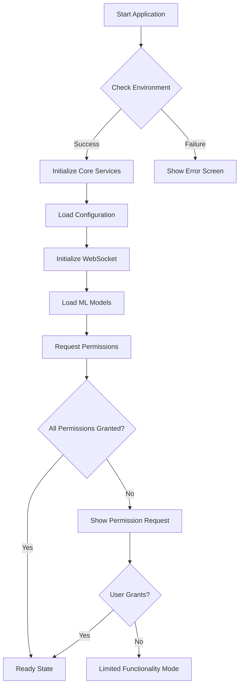
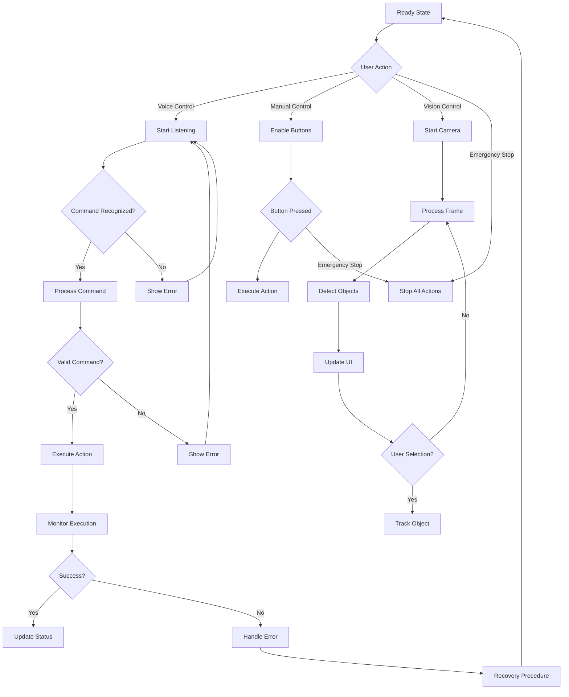
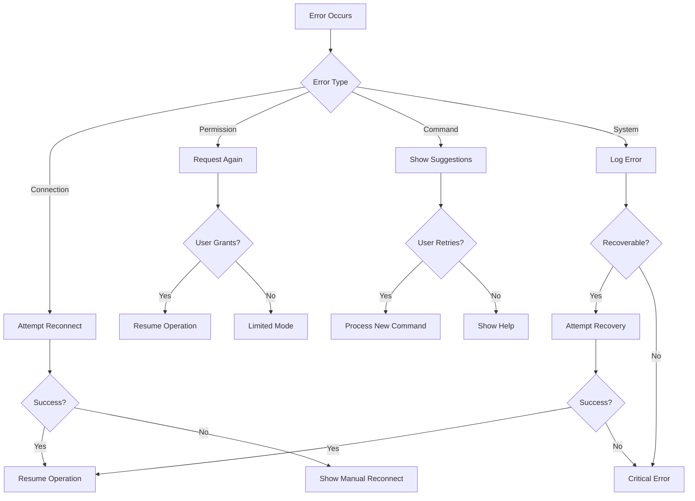
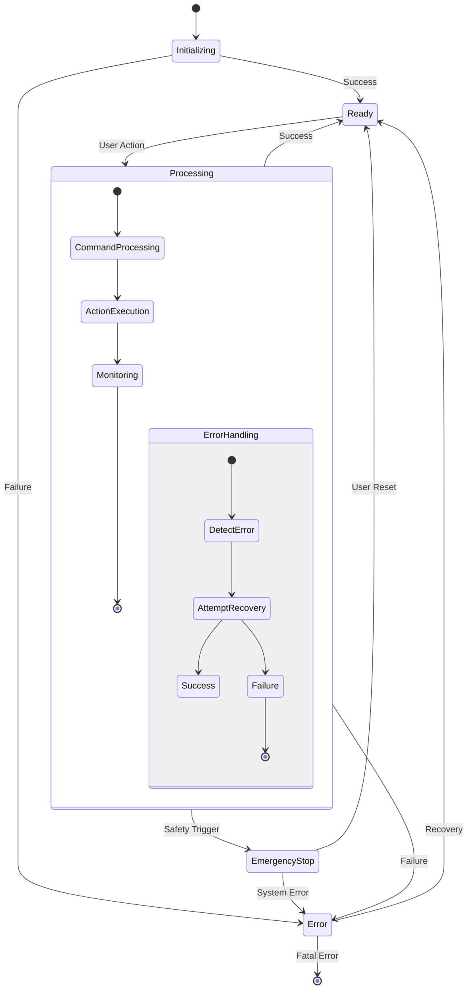
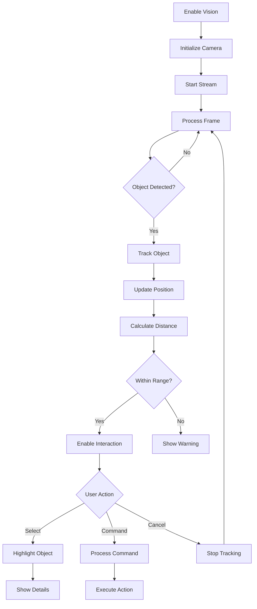
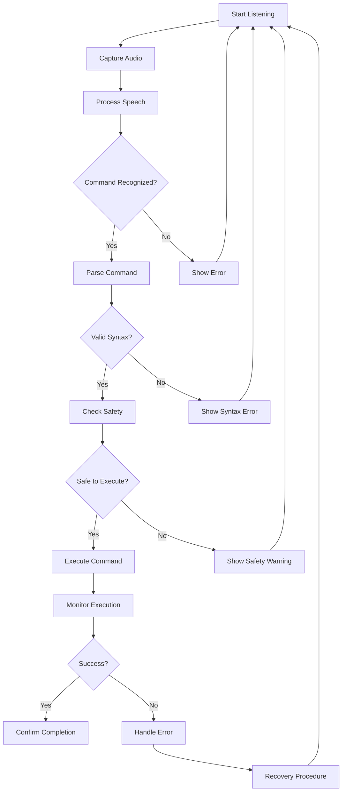
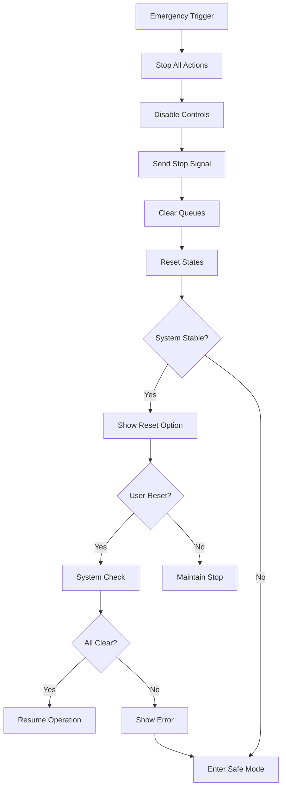

# HRCi Application Logic Flow

## 1. Application Startup Flow

## 2. Main Control Flow

## 3. Error Handling Flow

## 4. State Transition Flow

## 5. Vision System Flow

## 6. Voice Control Flow

## 7. Emergency Stop Flow

Each flowchart represents a specific aspect of the application's logic, showing:
- Decision points
- State transitions
- Error handling
- Recovery procedures
- User interactions
- System responses

The flows are designed to be:
1. Clear and intuitive
2. Comprehensive in error handling
3. Safe in operation
4. Easy to maintain and extend 