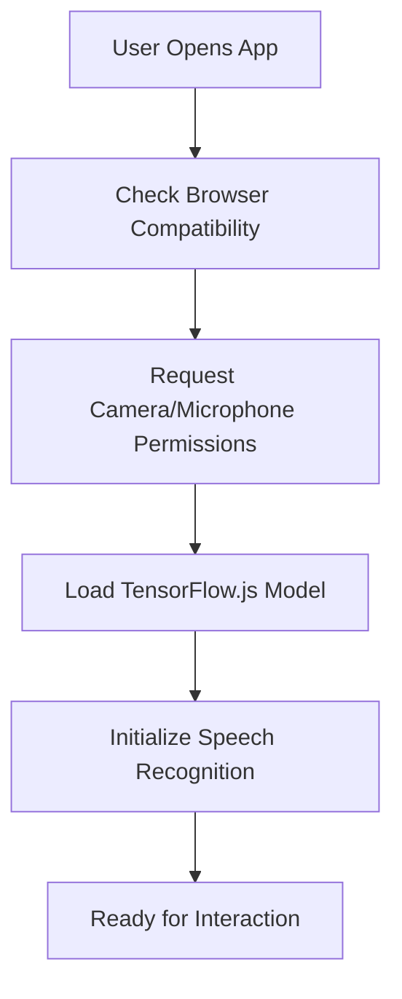
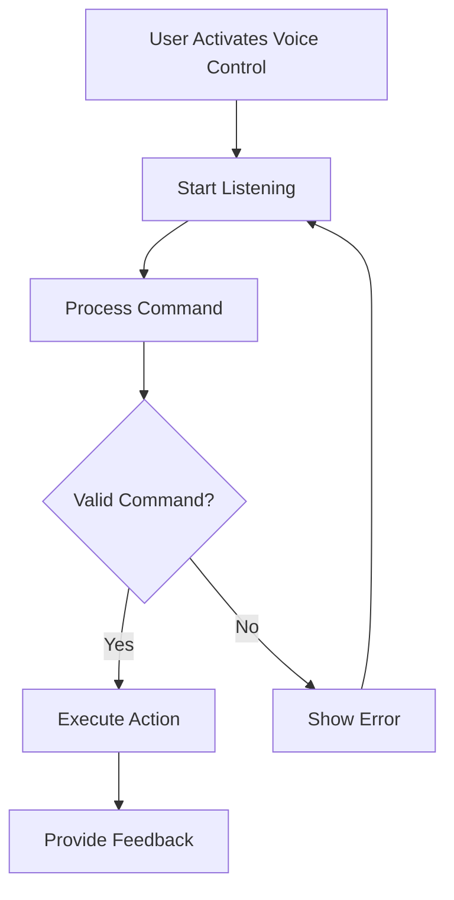
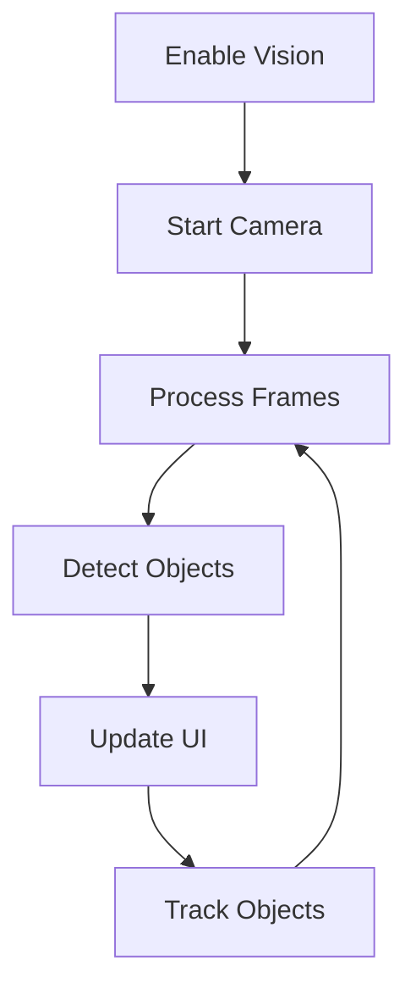
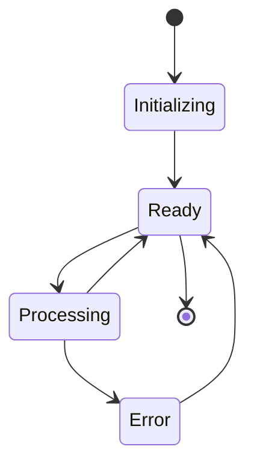

# HRCi User Flow and Application Logic

## 1. Application Overview

HRCi (Human-Robot Control Interface) is a web-based application that enables users to control robots through multiple interaction modes. The application follows a clear, intuitive flow while maintaining robust error handling and safety measures.

## 2. Core User Flows

### 2.1 Initial Setup and Connection



1. **Browser Compatibility Check**
   - Verify WebRTC support
   - Check for required APIs
   - Validate HTTPS connection

2. **Permission Requests**
   - Camera access for vision
   - Microphone access for voice control
   - Storage access for settings

3. **System Initialization**
   - Load ML models
   - Initialize speech recognition
   - Set up WebSocket connection

### 2.2 Voice Control Flow



1. **Command Recognition**
   - Listen for user speech
   - Convert speech to text
   - Parse command structure

2. **Command Processing**
   - Validate command syntax
   - Check vision requirements
   - Verify safety constraints

3. **Action Execution**
   - Send command to robot
   - Monitor execution
   - Provide real-time feedback

### 2.3 Computer Vision Flow



1. **Vision System Activation**
   - Start camera stream
   - Initialize object detection
   - Set up tracking

2. **Real-time Processing**
   - Frame capture
   - Object detection
   - Position tracking
   - Distance estimation

3. **UI Updates**
   - Display detected objects
   - Show confidence scores
   - Update tracking information

## 3. Control Modes

### 3.1 Manual Control

1. **Button Interface**
   - Direct action buttons
   - Parameter sliders
   - Mode selection

2. **Keyboard Control**
   - WASD for movement
   - Number keys for speed
   - Space for emergency stop

### 3.2 Voice Control

1. **Command Structure**
   ```
   [Action] [Object] [Parameters]
   Example: "Move forward 2 meters"
   ```

2. **Supported Commands**
   - Movement commands
   - Object interaction
   - System control
   - Status queries

### 3.3 Vision-Assisted Control

1. **Object Selection**
   - Click on detected objects
   - Voice reference
   - Automatic tracking

2. **Safety Features**
   - Collision avoidance
   - Distance monitoring
   - Emergency stop triggers

## 4. Error Handling and Recovery

### 4.1 Common Error Scenarios

1. **Connection Issues**
   - WebSocket disconnection
   - Camera access failure
   - Microphone access denied

2. **Command Errors**
   - Invalid syntax
   - Unrecognized commands
   - Safety constraint violations

3. **System Errors**
   - Model loading failure
   - Processing errors
   - Resource limitations

### 4.2 Recovery Procedures

1. **Automatic Recovery**
   - Reconnection attempts
   - Command retry
   - System reset

2. **User-Assisted Recovery**
   - Clear error messages
   - Suggested actions
   - Help documentation

## 5. State Management

### 5.1 Application States

1. **Connection State**
   - Disconnected
   - Connecting
   - Connected
   - Error

2. **Control State**
   - Manual
   - Voice
   - Vision-assisted
   - Emergency stop

3. **System State**
   - Initializing
   - Ready
   - Processing
   - Error

### 5.2 State Transitions



## 6. Safety Considerations

### 6.1 Emergency Procedures

1. **Emergency Stop**
   - Button press
   - Voice command
   - Automatic triggers

2. **Safety Checks**
   - Command validation
   - Environment monitoring
   - System health checks

### 6.2 User Feedback

1. **Visual Indicators**
   - Status colors
   - Warning messages
   - Error notifications

2. **Audio Feedback**
   - Command confirmation
   - Warning sounds
   - Error alerts

## 7. Future Enhancements

### 7.1 Planned Features

1. **Enhanced Interaction**
   - Gesture control
   - Multi-modal commands
   - Context awareness

2. **Advanced Safety**
   - Predictive collision avoidance
   - Environmental mapping
   - Advanced error recovery

### 7.2 Integration Plans

1. **LLM Integration**
   - Natural language understanding
   - Context-aware commands
   - Advanced error handling

2. **Text-to-Speech**
   - Enhanced feedback
   - Multiple languages
   - Emotion expression 